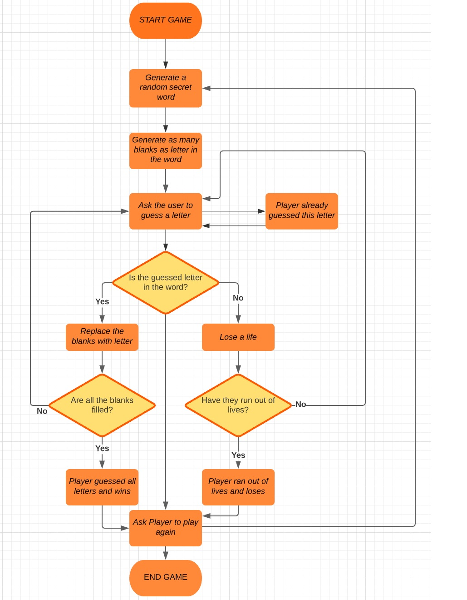
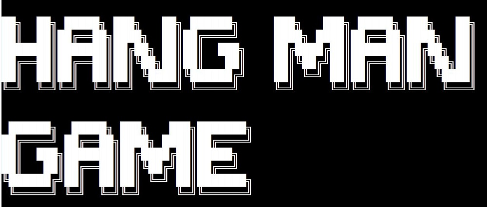
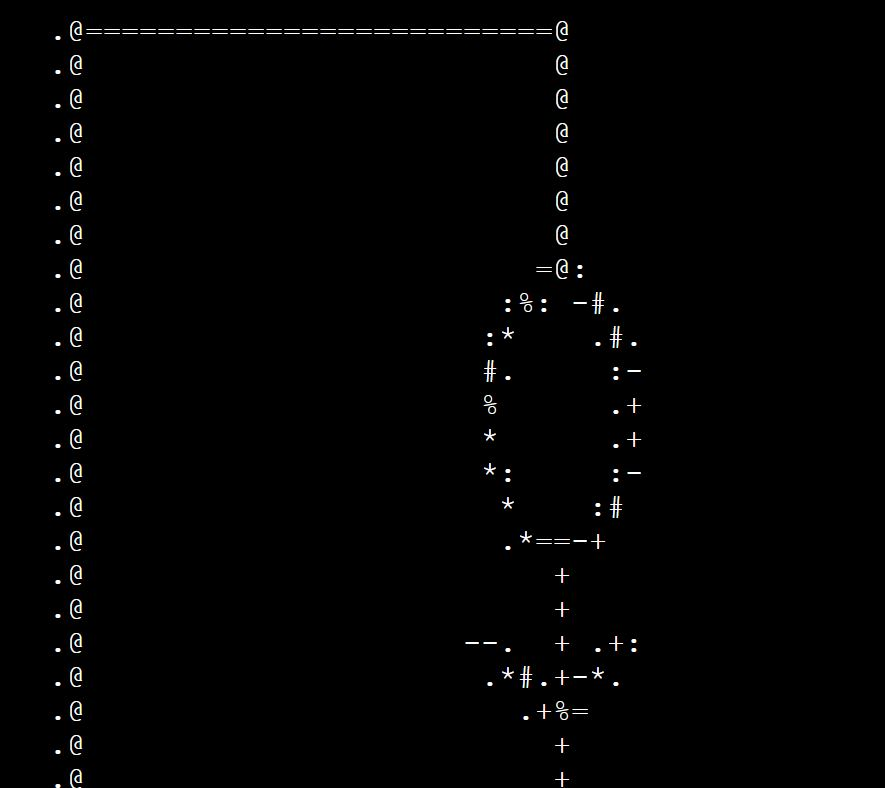
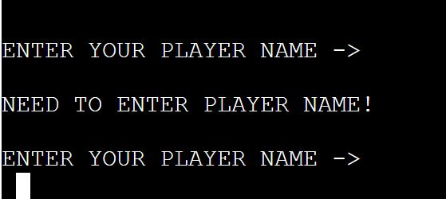
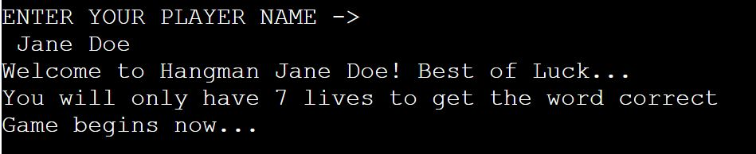

# HANGMAN GAME

For my portfolio 3 project I have chosen a fun school favourite, a well known game called Hangman. This game Hangman will be displayed in a Python terminal, which runs through the Code Institute terminal on Heroku.

[View the live project here.](https://hangman-83.herokuapp.com/)

---

---
# How to play Hangman
Hangman is a paper and pencil guessing game for two or more players. One player thinks of a word, phrase or sentence and the other tries to guess it by suggesting letters or numbers, within a certain number of guesses.
However, in this game, one player is only needed as the words are automatically randomized and the lives will automatically be deducted for any incorrect guess. The User will enters their desired Username and the game will select a random word from a word list.
The word to be guessed will be displayed as _ _ _ _ _ and with an image of a hangman in different stages depending on the number of incorrect guesses. In this game the player will have 8 attempts to guess the correct letters for the word. When the User guesses a letter that is in the random word, the terminal will display the correct letter guessed, this will replace the blank dashes _ _ _ with the correct letter and in the correct position, in this example the letter “t” will replace the third blank space of the random word _ _t. This process will continue until the player has run out of guesses and then will be 'You are HANGED in the gallows!!' on a platform.  This will be shown on the terminal and a message letting the User know they have 'died' and have lost the game. The other option will be that the User continued guessing the correct letters and got the correct word before running out of lives. When the User has either wins or loses, they will have the option to play again.

# User Experience (UX)

+ ## User Stories
    - ### First Time User
    1. As a first time user, I want to easily navigate through the game with simple inputs.
    2. As a first time user, I want to be able to have fun, enjoy the game and feel nostalgic when playing.
    - ### Returning User
    1. As a Returning user, I want the navigation to be the same as it was the first time to keep it familiar.
     2. As a Returning user, I want to be able to guess different words that I haven't guessed before.
    - ### Frequent User
    1. As a Frequent User, I want to be able to notice different words still being guessed.
    2. As a Frequent User, I want the navigation to be the same throughout.

---
# Flow Chart of Hang Man Game

----
# Features
## Existing Features

* **Game Heading & Hangman Display**
  * A appealing ASCII code text and display image of the Hangman Game will be shown to introduce the player to the game.

* **Player Name**
  * The player will be asked to enter a name before the Hangman Game can start, The game will not start without a player name. If the player just leaves it blank and press enter a prompt message letting the player know that they will need to enter a name in order to start the game.

* **Welcome Message**
  * After the player has entered a player name a short welcome message will be shown. A message letting the player know how many lives that they have to play this game will also be shown.

* **Guessing the letter or Word**
  * The Guessing screen displays the hangman title, the first stage of the hangman game. Underneath the hangman display it will also show the player the number of letters of the word that they need to guess. The player is asked to input a guess of a letter or word.

---
# Technology Used

---
# Testing

---
# Deployment

---
# Credit & Acknowledgement

