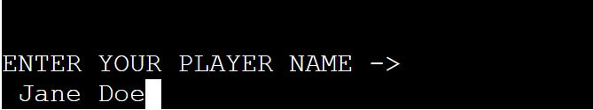

# HANGMAN GAME

For my portfolio 3 project I have chosen a fun school favourite, a well known game called Hangman. This game Hangman will be displayed in a Python terminal, which runs through the Code Institute terminal on Heroku.

[View the live project here.](https://hangman-83.herokuapp.com/)

---

---
# How to play Hangman
Hangman is a paper and pencil guessing game for two or more players. One player thinks of a word, phrase or sentence and the other tries to guess it by suggesting letters or numbers, within a certain number of guesses.
However, in this game, one player is only needed as the words are automatically randomized and the lives will automatically be deducted for any incorrect guess. The User will enters their desired Username and the game will select a random word from a word list.
The word to be guessed will be displayed as _ _ _ _ _ and with an image of a hangman in different stages depending on the number of incorrect guesses. In this game the player will have 8 attempts to guess the correct letters for the word. When the User guesses a letter that is in the random word, the terminal will display the correct letter guessed, this will replace the blank dashes _ _ _ with the correct letter and in the correct position, in this example the letter “t” will replace the third blank space of the random word _ _t. This process will continue until the player has run out of guesses and then will be 'You are HANGED in the gallows!!' on a platform.  This will be shown on the terminal and a message letting the User know they have 'died' and have lost the game. The other option will be that the User continued guessing the correct letters and got the correct word before running out of lives. When the User has either wins or loses, they will have the option to play again.

# User Experience (UX)

+ ## User Stories
    - ### First Time User
    1. As a first time user, I want to easily navigate through the game with simple inputs.
    2. As a first time user, I want to be able to have fun, enjoy the game and feel nostalgic when playing.
    - ### Returning User
    1. As a Returning user, I want the navigation to be the same as it was the first time to keep it familiar.
     2. As a Returning user, I want to be able to guess different words that I haven't guessed before.
    - ### Frequent User
    1. As a Frequent User, I want to be able to notice different words still being guessed.
    2. As a Frequent User, I want the navigation to be the same throughout.

---
# Flow Chart of Hang Man Game

----
# Features
## Existing Features

* **Game Heading & Hangman Display**
  * A appealing ASCII code text and display image of the Hangman Game will be shown to introduce the player to the game.

* **Player Name**
  * The player will be asked to enter a name before the Hangman Game can start, The game will not start without a player name. If the player just leaves it blank and press enter a prompt message letting the player know that they will need to enter a name in order to start the game.

* **Welcome Message**
  * After the player has entered a player name a short welcome message will be shown. A message letting the player know how many lives that they have to play this game will also be shown.

* **Guessing the letter or Word**
  * The Guessing screen displays the hangman title, the first stage of the hangman game. Underneath the hangman display it will also show the player the number of letters of the word that they need to guess. The player is asked to input a guess of a letter or word.

* **Incorrect Letter**
  * when the player guess is valid but is not in the word, they are greeted with text stating that their guess was not in the word, therefore being incorrect the player will lose a life and this will display the next stage of hangman.

* **Correct Letter**
  * When the player guess is valid and also correct, they are greeted with text praising them and stating that their guess is in the word, therefore being correct a life will not be lost so the hangman display will stay at the same stage until the next correct or incorrect guess.

* **Guess Word**
  * The player can type in the whole word if they feel that after a few guesses, they already know the secret word. Once the whole word is typed a message will allow the player to tell them if their guess was correct or not.

* **Letters Guessed**
  * Each time the player enters a valid letter it will be shown on the display to let the player know which letters that they have tried. In theory it should stop the player from inputting repeated letters.

* **Already Guessed**
  * As the game plays on, often the player may accidentally guess a letter that they have already guessed, even though we have added the letters on to the Letter Guessed display. As a fall back we will also display a text to let the player know that they have already guessed that letter.

* **Invalid Guess**
  * When the player guess is invalid(1,&,?) etc, they are are greeted with text stating that their guess is not a valid character(not a letter).

* **Hangman Display**
  * The Player will be able to see their progress of not only the hangman stages but also the letters that they have used previously in the current game. With each incorrect letter or word guessed, the hangman display will go to the next 'stage' of the display until the player gets the word correct or runs out of lives, which will show either a congratulations screen or an unfortunate lose screen.

* **Winner Screen**
  * The win screen is display once the player have guessed the word correctly, once this happens the user will be greeted with a congratulations text and will ask the player to input a "Y" or "N" to either play again or exit the game. As the game was not designed with a menu when the player input "N" the game will just stop running in the terminal.

* **Loser Screen**
  * The lose screen is displayed when the player has finally used up all of their lives and lets them know that they have lost the game. The screen will also display the last stage of the hangman figure, showing that they have died.Underneath the hangman display, it will also show all the correct letters that they have guessed before they have ran out of lives. On a new line it greets the player to an unfortunate message letting the player know that they did not get the word and have been 'HANGED in the GALLOWS!', it also display the actual secret word and a encouraging text to persuade the player to play again.

* **Features Left To Implement**
  * Add a High Score menu to the Hangman Game
  * Add a two player game so that 2 players could have the same word and take it in turn to guess the word, but will have their own hangman display to their Username.
  * Add different levels to the game, e.g easy = up to 4 letter words, normal = 5 - 6 letter words or hard = 7+ letter words.

---
# Technology Used
## Language used 
+ Python 
[View Information ](https://en.wikipedia.org/wiki/Python_(programming_language))

---
# Frameworks & Programs Used
1. Git was used for my project workspace.All the codes are saved on Git. All my codes was committed on Git and pushed to Github.
[Git ](https://en.wikipedia.org/wiki/Git)
2. GitHub was used to store the codes from my project after being pushed from Git.
[GitHub ](https://en.wikipedia.org/wiki/GitHub)
3.  Youtube tutorials on learning how to use isalpha() function properly for my Hangman Game.
[YouTube ](https://www.youtube.com/watch?v=HJpiAZDJrRY) 
4. Lucidchart is used to create and store flowchart for my Hangman Game.
[Lucid Chart ](https://www.lucidchart.com/pages/)  
5. Heroku is used to build, run and scale applications in a similar manner across most languages.
[Heroku ](https://www.heroku.com/)  
6. Windows 10 Paint was used on resizing my images for my readme file.
[Window 10 Paint](assets/images/paint.jpg)  
7. Text to ASCII Art Generator was used to get the Hangman Game Graphics heading
[Patorjk ](http://patorjk.com/software/taag/#p=display&f=ANSI%20Shadow&t=HANG%20MAN%20GAME)
8. Convert my Hangman display Image into ASCII Art
[Convertcase.net ](https://convertcase.net/ascii-art-generator/) 
9. The Hangman image that I used to convert into ASCII Art was taken from Facebook Hangman Game
[Facebook ](https://m.facebook.com/Playing-Hangman-with-your-status-272660568374/) 

---
# Testing
## Validator Testing  
PEP8 Python Validator - No errors were returned when passing through PEP8, only warning stating trailing white spaces for Hangman-display,hangman-logo and run.py file. words.py had no warnings
+ [PEP8 Validation for hangman.py ](assets/images/pep8-validation-hangman-display.JPG)  
+ [PEP8 Validation for hang_man_logo.py ](assets/images/pep8-validation-hangman-logo.JPG) 
+ [PEP8 Validation for run.py ](assets/images/pep8-validation-run.py.JPG) 
+ [PEP8 Validation for words.py ](assets/images/pep8-validation-words.py.JPG)  

* I checked that the Hangman logo, Hangman Display image does print onto the Heroku terminal correctly
* Tested all the code in the Code Institute Heroku terminal and also the terminal inside of Gitpod multiply times to check if the game runs smoothly and that it will not crash.
* Checked that symbols, numbers or empty spaces will come up as invalid guesses when guessing the word.

## Compatibility
The Hangman Game Python Project has been checked for compatibility on Chrome, Edge and Firefox. The game was not tested on Safari browser as I do not own any Apple devices or do I know any one who does.
+ [Compatibility- Chrome  ](assets/images/Compatibility-chrome.JPG) 
+ [Compatibility- Firefox ](assets/images/Compatibility-firefox.JPG)  
+ [Compatibility- Edge    ](assets/images/Compatibility-edge.JPG) 
* **Coding Issues**
  * When I was testing out my game on the gitpod terminal with my mentor, he pointed out that the letters does not fill in at the correct empty dash spaces. A new function was created to fix that minor issue.

* **Bugs**
  * No bugs were found

---
# Deployment
This Project was deployed using Code institute's mock terminal for Heroku

* **Steps for Deployment**
  * Fork or clone this repository.
  * Goto the Heroku Dashboard.
  * Select to create a new Heroku app.
  * Set the buildbacks to Python and NodeJS in that order.
  * Link the Heroku app to the repository.
  * click on **Deploy**

---
# Credit 
* **Code**
  * The hangman Display images was taken from a Youtuber called MJ Codes his name is MJ Linane
  [View ](https://github.com/mj-linane/cs4all-python-student-templates/blob/master/hangman-art.py)
  * I researched more on While loops,if else statements and function on W3school as I found it easier to understand.
  + [View if else statement from W3 School ](https://www.w3schools.com/python/python_conditions.asp) 
  + [View While Loop from W3 School ](https://www.w3schools.com/python/python_while_loops.asp) 
  + [View Python Functions from W3 School ](https://www.w3schools.com/python/python_functions.asp) 
  * The random word list was also taken from Youtube channel called Kite.
  [View ](https://github.com/kiteco/python-youtube-code/blob/master/build-hangman-in-python/words.py) 
  * For my Hangman Game I have taken inspiration from a YouTube channel called kite. Coding referenced on this video was partially used but was amended and modified for my own project.
[View ](https://www.youtube.com/watch?v=paUdvVuJTZc&list=PL96xVQjLpfmUgOIB83X768xYQbb6pRW3P&index=20) 

* **Other Resources**
  * I learnt and researched Markdown Syntax for my README file from a website called Mark Down Guide. This enabled me to learn how to use the correct syntax so that I can do the README file properly.
  [View ](https://www.markdownguide.org/cheat-sheet/)
  * My README file that I have written are based on the Code Institute Sample README file. Some of the headings are taken from it and some of the content are based on it as well.
   [View ](https://learn.codeinstitute.net/courses/course-v1:CodeInstitute+PE_PAGPPF+2021_Q2/courseware/b3378fc1159e43e3b70916fdefdfae51/605f34e006594dc4ae19f5e60ec75e2e/)
  * Information about how to play the Hangman game was taken from Wikipedia
  [View ](https://en.wikipedia.org/wiki/Hangman_(game))

## Acknowledgement
* My Mentor Antonio Rodriguez, who has supported me through the project with lots of valuable advice, help and encouragement.
I got a lot of help from my fellow Slackers from the Slack community.
